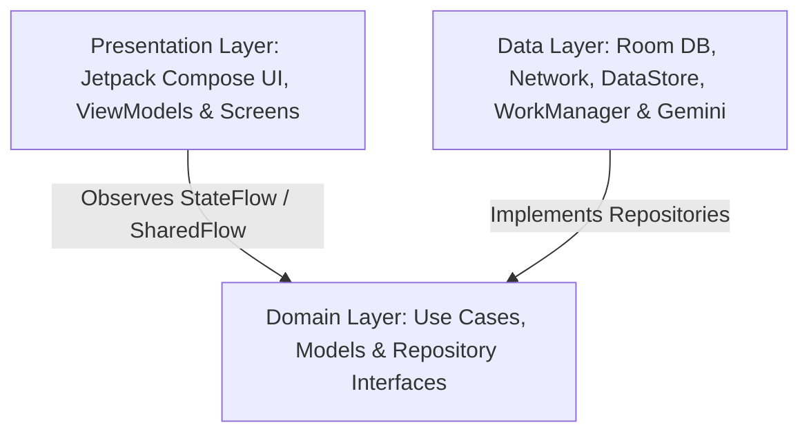

# 🚀 SkillFlow - Micro-Learning, Maximum Growth

**SkillFlow** is a modern, high-performance Android application built with **Jetpack Compose** and **Clean Architecture**. Designed for busy professionals and lifelong learners, SkillFlow delivers bite-sized "Knowledge Nuggets" tailored to career roadmaps, helping users build daily learning habits in just 5–10 minutes a day.

---

## 📑 Table of Contents
- [Executive Summary](#-executive-summary)
- [✨ Key Features](#-key-features)
- [🛠 Tech Stack & Libraries](#-tech-stack--libraries)
- [🏗 Architecture & Design Patterns](#-architecture--design-patterns)
- [📂 Project Directory Structure](#-project-directory-structure)
- [📱 Screens & Navigation Flow](#-screens--navigation-flow)
- [⚙️ Setup & Build Instructions](#%EF%B8%8F-setup--build-instructions)
- [🧪 Testing & Quality Assurance](#-testing--quality-assurance)
- [🤝 Contributing & License](#-contributing--license)

---

## 🎯 Executive Summary

In today's fast-paced world, traditional long-form courses can cause information overload and burnout. **SkillFlow** solves this by breaking down complex career topics into concise, actionable lessons (Nuggets), reinforced by:
* Google Gemini AI learning assistant
* Interactive quizzes & 3D card flips
* Daily streak notifications & customizable reminders
* Visual roadmaps & integrated note-taking
* Gamification (streaks, XP, and leveling)

---

## ✨ Key Features

### 🤖 AI Assistant & Smart Learning
* **Google Gemini AI Integration**: Context-aware AI Assistant Bottom Sheet (`AiChatBottomSheet.kt`) powered by Google Generative AI Client SDK (`gemini-1.5-flash-latest` with `gemini-1.5-pro` fallback). Ask real-time questions directly related to any knowledge nugget.

### ⏰ Notifications & Daily Streak Reminders
* **WorkManager Reminder Engine**: Background daily reminder scheduler (`DailyReminderWorker` & `ReminderManagerImpl`) to maintain learning habits.
* **Custom Time Picker & Notification Channel**: Set personalized notification time (e.g. 9:00 PM) via TimePicker in Settings, integrated with Android `NotificationHelper` (`daily_streak_reminder_channel`).

### 💎 Knowledge Nuggets & Interactive Cards
* **3D Card Flip Animation**: Smooth front/back card rotations for engaging micro-lessons.
* **Smart Filtering & Search**: Find nuggets instantly by career path, difficulty level, or search keywords.
* **In-App Note Taking**: Create, edit, and delete custom personal notes attached directly to specific knowledge nuggets (`UserNoteEntity`).
* **Bookmarks & Offline Access**: Save essential nuggets for quick offline reading.

### 🎮 Gamification & Learning Progress
* **Bento Grid Dashboard**: Asymmetrical Bento Grid header with 24dp rounded corners, featuring a large Progress card alongside balanced Streak and Saved Items tiles.
* **Category Pills with Distinct Icons**: Simplified horizontal filter pills ("All", "Today", "History", "Pick Date") with unique icons for quick date and topic filtering.
* **Daily Streak Tracker**: Automatically calculates learning streaks based on completion dates (`StreakCalculatorTest` verified).
* **XP & Level Progression**: Earn XP points by completing nuggets and passing quizzes to level up your career profile.

### 🎯 Quizzes & Knowledge Evaluation
* **Interactive MCQ Engine**: End-of-nugget quizzes with immediate answer feedback and score summaries.
* **In-App Review Integration**: Triggers Google Play In-App Review prompts upon high score accomplishments ("Aha!" moments).

### 🎨 Modern UI & UX Excellence
* **100% Jetpack Compose & Material 3**: Declarative UI with Edge-to-Edge drawing and dynamic light/dark mode support.
* **Screen-Based Package Architecture**: Strict separation where every screen has its own dedicated package (`ui/screens/<feature>/<screen>/`) containing its Screen, ViewModel, and isolated components sub-package (`components/`).
* **Single Component Per File**: Unbundled reusable UI components into dedicated files for maximum maintainability.
* **Custom Shimmer Skeleton Loaders**: Smooth loading states across Home (`NuggetCardSkeleton`, `ProgressCardSkeleton`), Roadmaps (`RoadmapStepSkeleton`), and Onboarding (`CareerPathSkeleton`).
* **Multi-Language Localization**: Full dynamic runtime switching between English and Bengali (EN/BN) using `UiText` wrappers.

### 🔒 Secure Authentication & Data Privacy
* **Firebase Auth**: Complete authentication suite including Login, Sign Up, and Password Reset.
* **Full Account Deletion**: One-click account removal compliant with Google Play Policy (purges Firebase Auth data along with local Room DB & DataStore entries).

### 📦 Play Store & Background Work
* **Automatic JSON Data Seeding**: `DataSeedWorker` populates Room database on initial application launch using **WorkManager**.
* **In-App Updates**: Flexible and Immediate Play Store update prompt mechanisms.

---

## 🛠 Tech Stack & Libraries

| Category | Technology / Library |
| :--- | :--- |
| **Language** | Kotlin 2.0+ (Coroutines & Flow) |
| **UI Framework** | Jetpack Compose + Material 3 |
| **SDK Versions** | `minSdk: 24`, `targetSdk: 37`, `compileSdk: 37` |
| **AI Integration** | Google Generative AI Client SDK (`gemini-1.5-flash-latest` / `gemini-1.5-pro`) |
| **Architecture** | Clean Architecture + MVVM + MVI State Management + Screen-Based Package Architecture |
| **Dependency Injection** | Hilt (Dagger Hilt + Hilt Work + Hilt Navigation Compose) |
| **Local Database** | Room Persistence Library |
| **Preferences & State** | DataStore Preferences |
| **Networking & JSON** | Retrofit 2 + OkHttp 5 + Kotlinx Serialization |
| **Background Processing**| WorkManager (`DailyReminderWorker`, `DataSeedWorker`) |
| **Notifications** | Android NotificationManager + Custom Notification Channel |
| **Image Loading** | Coil Compose |
| **Animations** | Jetpack Compose Graphics + Lottie Compose |
| **Firebase Stack** | Firebase Auth, Analytics, Crashlytics, Cloud Messaging (FCM) |
| **Play Services** | Play In-App Review & Play In-App Update APIs |
| **Logging** | Timber |

---

## 🏗 Architecture & Design Patterns

SkillFlow strictly adheres to **Clean Architecture** and **Screen-Based Package Architecture** principles to promote testability, maintainability, and scalability.



1. **Presentation Layer (`ui/`)**:
   * Organised using **Strict Screen-Based Package Architecture** (`ui/screens/<feature>/<screen>/`).
   * **Dedicated Screen Packages**: Every screen has its own sub-package containing its `*Screen.kt` and corresponding `*ViewModel.kt`.
   * **Component Isolation**: Screen-specific UI components reside inside a dedicated `components/` sub-package within that specific screen's package.
   * Shared global components live in `ui/common/`, theme files in `ui/theme/`, and routes in `ui/navigation/`.
   * Uses **MVVM** pattern with `StateFlow` for state rendering and `SharedFlow` for single-event notifications.
2. **Domain Layer (`domain/`)**:
   * Contains core business models (`KnowledgeNugget`, `CareerPath`, `UserNote`, `QuizQuestion`), `ReminderManager`, `AnalyticsHelper`, and repository interfaces (`GeminiRepository`, `AuthRepository`, `SkillRepository`, `SettingsRepository`).
   * Completely independent of framework specifics.
3. **Data Layer (`data/`)**:
   * **Local Data**: Room DAO (`SkillDao`) and Database (`SkillDatabase`).
   * **Preferences**: DataStore for user theme, onboarding state, reminder times, and language settings.
   * **Workers**: `DataSeedWorker` for background JSON asset ingestion, `DailyReminderWorker` for daily notifications.
   * **Repositories**: Concrete implementations handling caching, Room operations, Gemini AI client requests, and remote synchronization.

---

## 📂 Project Directory Structure

```text
com.example.skillflow
├── SkillFlowApp.kt            # Application Class & Hilt/Timber Setup
├── MainActivity.kt             # Main Entry Point with Edge-to-Edge NavHost & Reminder Initialization
├── data/
│   ├── analytics/             # Firebase Analytics Helper Implementation
│   ├── local/                 # Room Database, DAO & Entities (Nugget, Note, Career)
│   ├── manager/               # Play Store In-App Review & Update Managers
│   ├── notification/          # NotificationHelper & Daily Reminder Channel Configuration
│   ├── remote/                # Retrofit API & DTO definitions
│   ├── repository/            # Repository Implementations (Skill, Auth, Settings, Gemini)
│   ├── util/                  # Asset Managers & JSON Parsers
│   └── worker/                # WorkManager Jobs (DailyReminderWorker, DataSeedWorker)
├── di/                        # Hilt Modules (Database, Network, Firebase, Repositories, Managers)
├── domain/
│   ├── analytics/             # Analytics Interfaces
│   ├── manager/               # Manager Interfaces (ReminderManager, PlayStoreManager)
│   ├── model/                 # Pure Domain Data Models
│   ├── repository/            # Repository Interfaces (GeminiRepository, AuthRepository, etc.)
│   └── util/                  # Resource wrappers & UiText helpers
└── ui/                        # Professional Screen-Based UI Layer
    ├── common/                # Reusable Global Components (NuggetCard, AuthButton, TopBar, Skeletons)
    ├── navigation/            # Type-Safe Routes (Screen.kt), SkillFlowNavHost & BottomBar
    ├── theme/                 # Material 3 Colors, Spacing, Typography & Theme
    └── screens/               # Modular Screen Packages (Screen-Based Package Architecture)
        ├── auth/              # Auth Feature
        │   ├── login/         # LoginScreen.kt
        │   ├── signup/        # SignUpScreen.kt
        │   ├── forgotpassword/# ForgotPasswordScreen.kt
        │   └── AuthViewModel.kt
        ├── bookmarks/         # Bookmarks Feature (BookmarksScreen & BookmarksViewModel)
        ├── detail/            # Detail Feature & AI Assistant (3D Flip Card, KnowledgeCard, NoteInputCard, AiChatBottomSheet & DetailViewModel)
        ├── home/              # Home Dashboard Feature (BentoGrid, CategoryPills, DailyProgressCard & HomeViewModel)
        ├── onboarding/        # Onboarding Feature (Pager, CareerPathSelection & OnboardingViewModel)
        ├── profile/           # Profile & Settings Feature
        │   ├── profile/       # ProfileScreen.kt, ProfileViewModel.kt & components/StatCard.kt
        │   ├── settings/      # SettingsScreen.kt, SettingsViewModel.kt & components/LanguageToggleButton.kt, SettingsItem.kt
        │   └── privacypolicy/ # PrivacyPolicyScreen.kt
        ├── quiz/              # Quiz Feature (Interactive Quiz, QuizResultScreen & QuizViewModel)
        └── roadmap/           # Roadmap Feature (Visual Career Roadmap Steps & Skeletons)
```

---

## 📱 Screens & Navigation Flow

The app leverages **Type-Safe Jetpack Compose Navigation** with Kotlinx Serialization (`@Serializable` routes):

1. **Splash Screen**: Native Android 12+ Splash API transition.
2. **Onboarding**: Multi-page introduction with career path selection.
3. **Authentication**:
   * **Login**: Email/password authentication via Firebase.
   * **Sign Up**: Account creation with validation.
   * **Forgot Password**: Password reset dispatch.
4. **Main Dashboard (Home)**: Modern Bento Grid layout (Progress, Daily Streak & Saved Bookmarks tiles), Category Pills with distinct icons, search bar, and recommended nuggets.
5. **Roadmap**: Visual progress node flow through selected career path steps.
6. **Detail, Notes & AI Chat**: 3D flip card learning view with integrated personal note-taking and **Google Gemini AI Assistant** chat bottom sheet.
7. **Quiz Screen**: Multiple-choice assessment with instant score computation and reward prompts.
8. **Bookmarks**: Saved offline nuggets.
9. **Profile & Settings**: Level/XP progress visualizer, English/Bengali language toggle, dark mode toggle, customizable daily streak reminder time, and privacy settings.

---

## ⚙️ Setup & Build Instructions

### Prerequisites
* **Android Studio**: Ladybug / Meerkat or newer recommended.
* **JDK Version**: Java 17.
* **Android SDK**: API level 37 (Minimum API level 24).

### Building the Project
1. **Clone the Repository**:
   ```bash
   git clone https://github.com/your-username/Skillflow-Kotlin.git
   cd Skillflow-Kotlin
   ```
2. **Gemini API & Firebase Setup**:
   * Add `GEMINI_API_KEY=your_gemini_api_key` in `local.properties`.
   * Add your `google-services.json` file inside the `app/` directory.
3. **Build & Run**:
   * Sync Gradle dependencies.
   * Select an emulator or physical device running Android 7.0 (API 24) or higher.
   * Run the `:app` configuration.

---

## 🧪 Testing & Quality Assurance

* **Unit Testing**: Business logic verified via JUnit 4 (e.g., `StreakCalculatorTest`).
* **UI Testing**: Compose UI test harness configured with Espresso and Compose UI Test Manifest.
* **Code Shrinking & Security**: Proguard/R8 rules configured for release builds with `isMinifyEnabled = true` and `isShrinkResources = true`.

---

## 🤝 Contributing & License

Contributions are welcome! Feel free to open issues or submit pull requests.

Developed with ❤️ by **MD. AL-MUHEETU**
